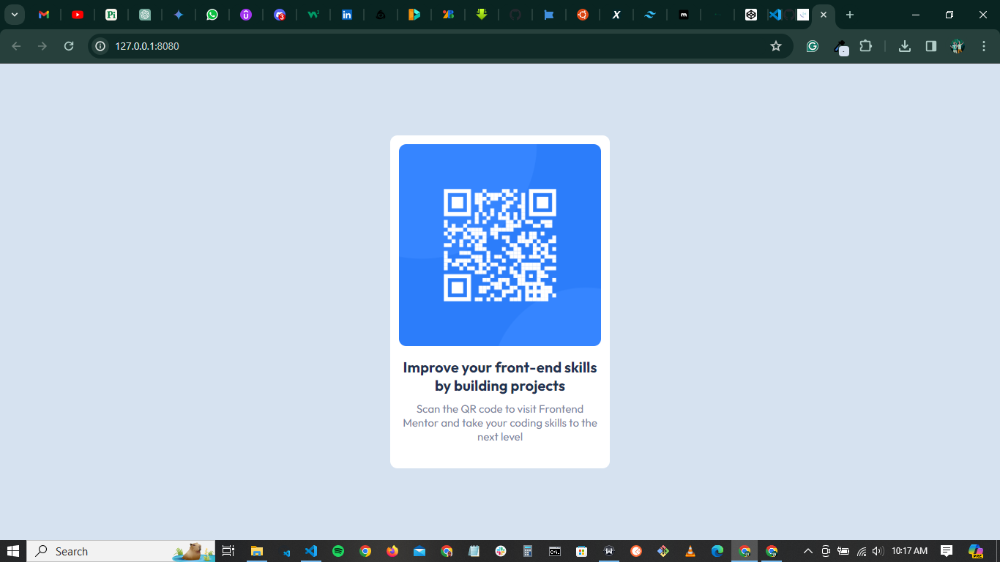

# Frontend Mentor - QR code component solution

This is a solution to the [QR code component challenge on Frontend Mentor](https://www.frontendmentor.io/challenges/qr-code-component-iux_sIO_H). Frontend Mentor challenges help you improve your coding skills by building realistic projects.

## Table of contents

<!-- - [Overview](#overview)
  - [Screenshot](./screenshot.png)
  - [Links](#links)
- [My process](#my-process)
  - [Built with](HTML,CSS)
  - [What I learned]()
  - [Continued development](#continued-development)
  - [Useful resources](#useful-resources)
- [Author](#author)
- [Acknowledgments](#acknowledgments) -->

-- QR Code demo
-- [Screenshot](./screenshot.png)
-- Built with HTML5 and CSS3
-- Nothing new 🤔
-- Author - Isaac Aladegbehingbe

## Overview

QR Code Demo

### Screenshot

### Links

- Solution URL: [Add solution URL here](https://your-solution-url.com)
- Live Site URL: [Add live site URL here](https://your-live-site-url.com)

### Built with

- Semantic HTML5 markup
- CSS custom properties
- Flexbox
- Desktop-first workflow

### What I learned

Nothing new 🤔

## Author

- Website - [Isaac Aladegbehingbe]
- Frontend Mentor - [Isaac-7it](https://www.frontendmentor.io/profile/Isaac-7it)
- Twitter - [@Isaactweet7](https://twitter.com/Isaactweet7)
